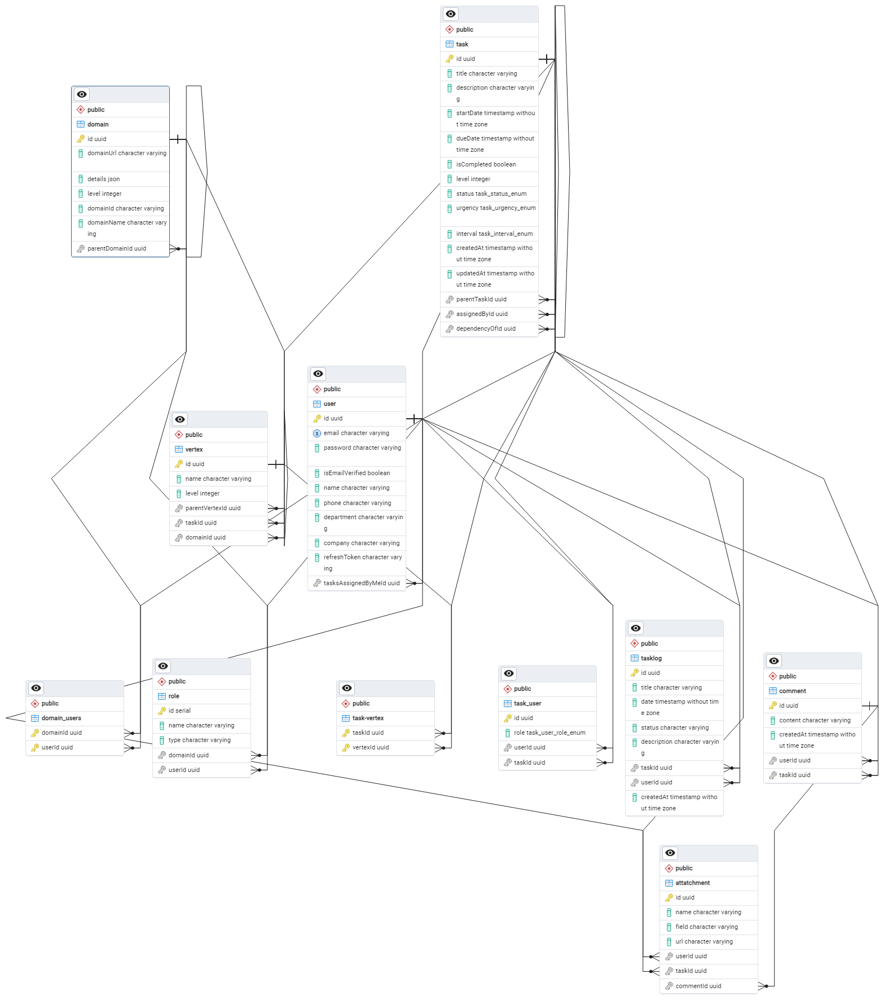

# **Employee Task Management Application**

## **Overview**

This project is an advanced Employee Task Management System built with NestJS and Next.js. The application provides robust features for task management, user roles, domain management, and more, tailored for enterprise-level solutions. The backend is powered by PostgreSQL using TypeORM, while the frontend is built with Next.js, delivering a seamless and interactive user experience. The project is hosted with the frontend on Vercel and the backend on Render.

## **Key Features**

* **User Management:** Manage users with authentication, roles, and permissions.
* **Task Management:** Create, assign, and track tasks with detailed logging.
* **Domain and Roles:** Organize users and tasks into domains with specific roles.
* **Comments and Attachments:** Add comments and attachments to tasks for better collaboration.
* **Real-Time Notifications:** Implemented using Socket.io and Redis.
* **Scalable Architecture:** Built with microservices in mind using NestJS and TypeORM.
* **Cloud Integration:** Utilizes AWS S3 for file storage, with secure deployment using Docker and Kubernetes.

## **Project Structure**

The project is modular, with each core functionality separated into its own module for easy maintenance and scalability. Below are the main modules included in the project:

* **Backend (NestJS):**
  * **AuthModule:** Handles user authentication and authorization.
  * **UsersModule:** Manages user-related operations like registration and profile updates.
  * **RolesModule:** Manages user roles and permissions.
  * **DomainModule:** Organizes users and tasks into specific domains.
  * **TasksModule:** Handles task creation, assignment, and tracking.
  * **CommentsModule:** Allows users to add comments to tasks.
  * **AttatchmentsModule:** Manages file attachments for tasks.
  * **TasklogModule:** Logs all task-related activities for audit purposes.
  * **VerticesModule:** Handles complex task structures with dependencies.
  * **S3Module:** Manages file uploads and storage in AWS S3.
* **Frontend (Next.js):**
  * Built using Next.js for server-side rendering and optimized performance.
  * Styled with Tailwind CSS for a responsive and modern user interface.
  * Integrated with the backend for seamless data flow and real-time updates.

## **Database**

The application uses PostgreSQL as the database, with TypeORM for managing database operations. The database schema is designed to handle complex relationships between tasks, users, domains, and roles.

<!-- Update the path to the correct image location -->

## **Getting Started**

### **Prerequisites**

* Node.js
* PostgreSQL
* Docker (optional for containerized deployment)
* AWS account (for S3 and other cloud services)

### **Installation**

1. **Clone the repository:**

   <pre>

bash
<button class="flex gap-1 items-center"><svg xmlns="http://www.w3.org/2000/svg" width="24" height="24" fill="none" viewBox="0 0 24 24" class="icon-sm"><path fill="currentColor" fill-rule="evenodd" d="M7 5a3 3 0 0 1 3-3h9a3 3 0 0 1 3 3v9a3 3 0 0 1-3 3h-2v2a3 3 0 0 1-3 3H5a3 3 0 0 1-3-3v-9a3 3 0 0 1 3-3h2zm2 2h5a3 3 0 0 1 3 3v5h2a1 1 0 0 0 1-1V5a1 1 0 0 0-1-1h-9a1 1 0 0 0-1 1zM5 9a1 1 0 0 0-1 1v9a1 1 0 0 0 1 1h9a1 1 0 0 0 1-1v-9a1 1 0 0 0-1-1z" clip-rule="evenodd"></path></svg>Copy code</button>

<code class="!whitespace-pre hljs language-bash">git clone https://github.com/subhadeepchowdhury41/tickmonitor.git
   cd tickmonitor
   </code>

</pre>
2. **Install dependencies:**
   **Backend:**

   <pre>

bash
<button class="flex gap-1 items-center"><svg xmlns="http://www.w3.org/2000/svg" width="24" height="24" fill="none" viewBox="0 0 24 24" class="icon-sm"><path fill="currentColor" fill-rule="evenodd" d="M7 5a3 3 0 0 1 3-3h9a3 3 0 0 1 3 3v9a3 3 0 0 1-3 3h-2v2a3 3 0 0 1-3 3H5a3 3 0 0 1-3-3v-9a3 3 0 0 1 3-3h2zm2 2h5a3 3 0 0 1 3 3v5h2a1 1 0 0 0 1-1V5a1 1 0 0 0-1-1h-9a1 1 0 0 0-1 1zM5 9a1 1 0 0 0-1 1v9a1 1 0 0 0 1 1h9a1 1 0 0 0 1-1v-9a1 1 0 0 0-1-1z" clip-rule="evenodd"></path></svg>Copy code</button>

<code class="!whitespace-pre hljs language-bash">cd backend
   npm i
   </code>

</pre>

   **Frontend:**

   <pre>

bash
<button class="flex gap-1 items-center"><svg xmlns="http://www.w3.org/2000/svg" width="24" height="24" fill="none" viewBox="0 0 24 24" class="icon-sm"><path fill="currentColor" fill-rule="evenodd" d="M7 5a3 3 0 0 1 3-3h9a3 3 0 0 1 3 3v9a3 3 0 0 1-3 3h-2v2a3 3 0 0 1-3 3H5a3 3 0 0 1-3-3v-9a3 3 0 0 1 3-3h2zm2 2h5a3 3 0 0 1 3 3v5h2a1 1 0 0 0 1-1V5a1 1 0 0 0-1-1h-9a1 1 0 0 0-1 1zM5 9a1 1 0 0 0-1 1v9a1 1 0 0 0 1 1h9a1 1 0 0 0 1-1v-9a1 1 0 0 0-1-1z" clip-rule="evenodd"></path></svg>Copy code</button>

<code class="!whitespace-pre hljs language-bash">
   cd frontend
   npm i
   </code>

</pre>
3. `strong`

   * `Create a `
   * `Add the required environment variables as per your setup.`
4. `strong`

   code

   `strong`

   `strong`

   code
5. `strong`

   * `The backend API will be available at `
   * `The frontend will be available at `

### **Database Setup**

* The application supports both local and hosted PostgreSQL databases.
* To switch between local and hosted databases, set `USE_LOCAL` in the `.env` file accordingly.

### **Deployment**

* **Frontend:** Hosted on Vercel for easy deployment and scalability.
* **Backend:** Hosted on Render for seamless and managed backend services.
* Containerization is handled using AWS ECR and EKS.
* CloudFront and Route 53 are used to optimize content delivery.

### **Demo**

* **Live Demo:** [TickMonitor](https://tickmonitor.vercel.app/)
* **Test Credentials:**
  * **Email:** [subha@gmail.com]()
  * **Password:** subha41

    Apologies for slow server. Free Plan 🥲

## **Contributing**

Contributions are welcome! Please open an issue or submit a pull request.

## **License**

This project is licensed under the MIT License - see the [LICENSE](https://github.com/subhadeepchowdhury41/tickmonitor/blob/main/LICENSE) file for details.
